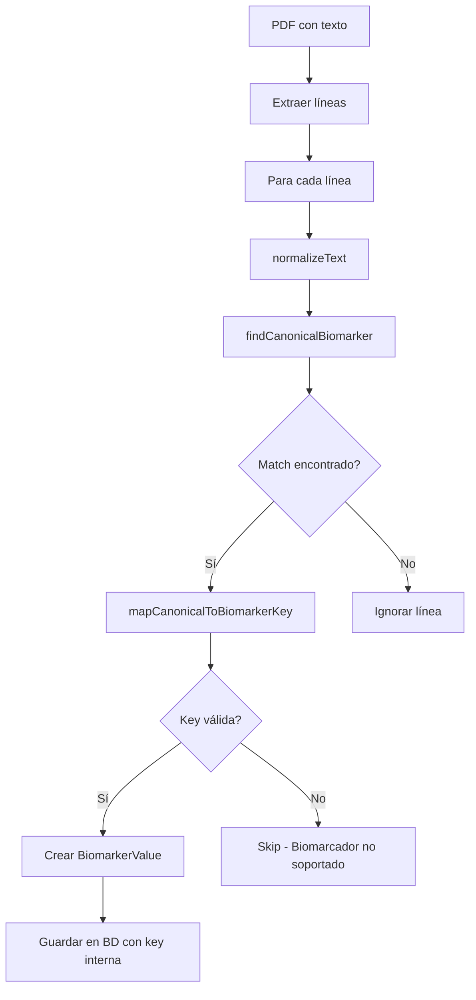

# Sistema de Aliases de Biomarcadores - GULA V1

**Fecha:** 2026-01-08  
**Estado:** ✅ Completado y Testeado  
**Tests:** 33/33 passing

---

## 🎯 Objetivo

Implementar un sistema robusto de aliases para biomarcadores que unifique los distintos nombres usados por laboratorios en LATAM en una sola key interna por biomarcador.

### Problemas que resuelve

❌ **Sin sistema de aliases:**
- Biomarcadores duplicados (LDL, Colesterol LDL, LDL-C como 3 biomarcadores distintos)
- Comparaciones incorrectas entre exámenes
- Historiales fragmentados por laboratorio
- Errores clínicos de interpretación

✅ **Con sistema de aliases:**
- Un biomarcador clínico = UNA key interna
- Muchos nombres externos → una sola key
- Historial unificado independiente del laboratorio
- Consistencia clínica garantizada

---

## 📐 Regla Central (NO NEGOCIABLE)

```
Un biomarcador clínico = UNA key interna
Muchos nombres externos → una sola key
Los aliases SOLO afectan parsing
Los aliases NO afectan score, lógica ni pesos
```

---

## 📋 Lista Oficial de Aliases - GULA V1

### 1. LDL - Colesterol de baja densidad

**Key interna:** `LDL`

**Aliases:**
- ldl
- ldl-c
- colesterol ldl
- colesterol de baja densidad
- lipoproteina de baja densidad

**Peso:** 1.5  
**Entra al score:** ✅ Sí

---

### 2. HDL - Colesterol de alta densidad

**Key interna:** `HDL`

**Aliases:**
- hdl
- hdl-c
- colesterol hdl
- colesterol de alta densidad
- lipoproteina de alta densidad

**Peso:** 1.2  
**Entra al score:** ✅ Sí

---

### 3. TRIGLYCERIDES - Triglicéridos

**Key interna:** `TRIGLYCERIDES`

**Aliases:**
- trigliceridos
- triglicéridos
- triglycerides
- tg

**Peso:** 1.2  
**Entra al score:** ✅ Sí

---

### 4. FASTING_GLUCOSE - Glucosa en ayunas

**Key interna:** `FASTING_GLUCOSE`

**Aliases:**
- glucosa
- glucosa en ayunas
- glucemia
- glucemia en ayunas
- fasting glucose
- blood glucose fasting

**Peso:** 1.5  
**Entra al score:** ✅ Sí

**⚠️ Regla especial:**  
Si NO se menciona ayuno explícitamente → La lógica de negocio debe validar contexto. El parser mapea a `FASTING_GLUCOSE` por defecto.

---

### 5. HBA1C - Hemoglobina glicosilada

**Key interna:** `HBA1C`

**Aliases:**
- hba1c
- hb a1c
- a1c
- hemoglobina glicosilada
- hemoglobina glucosilada
- glycated hemoglobin

**Peso:** 1.8  
**Entra al score:** ✅ Sí

---

### 6. ALT - Alanina aminotransferasa

**Key interna:** `ALT`

**Aliases:**
- alt
- tgp
- gpt
- alanina aminotransferasa
- alanine aminotransferase

**Peso:** 1.0  
**Entra al score:** ✅ Sí

---

### 7. AST - Aspartato aminotransferasa

**Key interna:** `AST`

**Aliases:**
- ast
- asat
- tgo
- got
- aspartato aminotransferasa
- aspartate aminotransferase

**Peso:** 0.8  
**Entra al score:** ✅ Sí

---

### 8. HS_CRP - PCR ultrasensible

**Key interna:** `HS_CRP`

**Aliases (OBLIGATORIOS - deben indicar alta sensibilidad):**
- pcr ultrasensible
- hs-crp
- high sensitivity crp
- c-reactive protein high sensitivity

**Peso:** 1.3  
**Entra al score:** ✅ Sí

**⚠️ CRÍTICO:**  
NUNCA inferir HS_CRP si no dice explícitamente "ultrasensible" o "high sensitivity". Si no está claro → mapear a `CRP_STANDARD` (conservador).

---

### 9. CRP_STANDARD - PCR normal (informativo)

**Key interna:** `CRP_STANDARD`

**Aliases:**
- proteina c reactiva
- proteína c reactiva
- pcr
- crp
- c-reactive protein

**Peso:** 0 (informativo)  
**Entra al score:** ❌ NO

**Nota:** NO se compara con HS_CRP. Son biomarcadores distintos con rangos diferentes.

---

### 10. EGFR - Filtrado glomerular estimado

**Key interna:** `EGFR`

**Aliases:**
- egfr
- tfg
- filtrado glomerular
- tasa de filtracion glomerular
- tasa de filtración glomerular
- estimated gfr
- mdrd
- ckd-epi

**Peso:** 1.0  
**Entra al score:** ✅ Sí

---

### 11. URIC_ACID - Ácido úrico

**Key interna:** `URIC_ACID`

**Aliases:**
- acido urico
- ácido úrico
- uric acid
- urate
- urato
- uratos sericos
- uratos séricos

**Peso:** 0.8  
**Entra al score:** ✅ Sí

---

## 🔧 Implementación Técnica

### Estructura del Sistema

```typescript
// 1. Definición de tipos canónicos (internos)
export type CanonicalBiomarker = 
  | 'LDL'
  | 'HDL'
  | 'TRIGLYCERIDES'
  | 'GLUCOSE_FASTING'
  | 'HBA1C'
  | 'ALT'
  | 'AST'
  | 'HS_CRP'
  | 'CRP_STANDARD'
  | 'EGFR'
  | 'URIC_ACID'
  | 'CREATININE';

// 2. Diccionario de aliases
export const BIOMARKER_ALIASES: Record<CanonicalBiomarker, string[]> = {
  LDL: ['LDL', 'LDL-C', 'COLESTEROL LDL', ...],
  // ...
};

// 3. Mapeo a keys internas
export function mapCanonicalToBiomarkerKey(canonical: CanonicalBiomarker): BiomarkerKey | null {
  // ...
}

// 4. Detección inteligente
export function findCanonicalBiomarker(text: string): CanonicalBiomarker | undefined {
  // ...
}
```

### Estrategia de Matching (3 fases)

El sistema usa una estrategia de matching en 3 fases para evitar falsos positivos:

#### FASE 1: Exact Match
Busca coincidencias exactas después de normalización.

```typescript
if (normalized === normalizedAlias) {
  return canonical;
}
```

**Ejemplo:** "LDL" → LDL ✅

---

#### FASE 2: Word Boundary Match
Para aliases cortos (≤5 caracteres), busca como palabra completa usando regex `\b`.

```typescript
if (normalizedAlias.length <= 5) {
  const regex = new RegExp(`\\b${normalizedAlias}\\b`);
  if (regex.test(normalized)) {
    return canonical;
  }
}
```

**Ejemplo:**
- "TGP" → ALT ✅
- "TG" NO captura "TGP" ✅ (word boundary protege)

**Esto resuelve:**
- TG vs TGP vs TGO (diferentes biomarcadores)
- ALT vs AST vs ASAT (diferentes biomarcadores)

---

#### FASE 3: Contains Match
Para aliases largos (>5 caracteres), usa matching parcial.

```typescript
if (normalizedAlias.length > 5) {
  if (normalized.includes(normalizedAlias)) {
    return canonical;
  }
}
```

**Ejemplo:** "COLESTEROL LDL DIRECTO" contiene "COLESTEROL LDL" → LDL ✅

---

### Normalización de Texto

Antes de cualquier matching, el texto se normaliza:

```typescript
export function normalizeText(text: string): string {
  let normalized = text.toUpperCase();
  
  // Remover tildes/acentos
  normalized = normalized
    .normalize('NFD')
    .replace(/[\u0300-\u036f]/g, '');
  
  // Normalizar espacios
  normalized = normalized.replace(/[\s\t]+/g, ' ').trim();
  
  return normalized;
}
```

**Resultado:**
- "Ácido Úrico" → "ACIDO URICO"
- "  LDL  " → "LDL"
- "Triglicéridos" → "TRIGLICERIDOS"

---

### Caso Especial: CRP/PCR

El sistema tiene lógica especial para diferenciar PCR ultrasensible (HS_CRP) de PCR normal (CRP_STANDARD):

```typescript
if (isPCR) {
  const isUltrasensitive = 
    normalized.includes('ULTRASENSIBLE') ||
    normalized.includes('HS-CRP') ||
    normalized.includes('HIGH SENSITIVITY');
  
  return isUltrasensitive ? 'HS_CRP' : 'CRP_STANDARD';
}
```

**Ejemplos:**
- "PCR ultrasensible" → HS_CRP ✅
- "PCR" → CRP_STANDARD ✅
- "Proteína C Reactiva" → CRP_STANDARD ✅
- "hs-CRP" → HS_CRP ✅

**NUNCA** asumir HS_CRP por defecto (conservador).

---

## 📊 Flujo de Parsing



### Ejemplo Real

**Input:** PDF con texto "Colesterol LDL: 150 mg/dL"

**Proceso:**
1. `normalizeText("Colesterol LDL")` → `"COLESTEROL LDL"`
2. `findCanonicalBiomarker("COLESTEROL LDL")` → `"LDL"`
3. `mapCanonicalToBiomarkerKey("LDL")` → `"LDL"`
4. Guardar en BD: `{ biomarker_code: "LDL", value: 150, unit: "mg/dL" }`

**Input:** PDF con texto "LDL-C: 150 mg/dL"

**Proceso:**
1. `normalizeText("LDL-C")` → `"LDL-C"`
2. `findCanonicalBiomarker("LDL-C")` → `"LDL"`
3. `mapCanonicalToBiomarkerKey("LDL")` → `"LDL"`
4. Guardar en BD: `{ biomarker_code: "LDL", value: 150, unit: "mg/dL" }`

**Resultado:** Ambos exámenes usan la misma key `LDL` → Historial unificado ✅

---

## ✅ Reglas de Comparación

### Regla de Oro

```
Solo comparar biomarcadores con la MISMA key interna
```

**Implementación en SQL:**

```sql
SELECT exam_date, value, status_at_time, unit
FROM biomarker_result
WHERE user_id = ?
  AND biomarker_code = ?  -- ← CLAVE: Solo el mismo tipo
ORDER BY exam_date DESC
LIMIT 2
```

### Casos de Uso

**✅ CORRECTO:**
```
Examen 1: LDL = 150 (alias "LDL")
Examen 2: LDL = 130 (alias "Colesterol LDL")
→ Comparar: MEJORÓ ✅
```

**❌ INCORRECTO (protegido por el sistema):**
```
Examen 1: HS_CRP = 2.5 (alias "PCR ultrasensible")
Examen 2: CRP_STANDARD = 5.0 (alias "PCR")
→ NO comparar: Son biomarcadores DISTINTOS ✅
```

---

## 🧪 Tests Implementados

**Archivo:** `backend/tests/biomarker-aliases.test.ts`

**Cobertura:**

### 1. Tests por Biomarcador (11 biomarcadores)
- Todos los aliases oficiales mapean correctamente
- Variaciones comunes funcionan
- Edge cases específicos

### 2. Tests de Separación CRP
- HS_CRP vs CRP_STANDARD no se confunden
- Palabras clave "ultrasensible" detectadas
- NUNCA asumir HS_CRP por defecto

### 3. Tests de Edge Cases
- Nombres desconocidos no crean biomarcadores nuevos
- Case insensitive (mayúsculas/minúsculas)
- Tildes/acentos normalizados
- Espacios extra manejados
- Guiones y caracteres especiales

### 4. Tests de Consistencia
- Laboratorio A y B usando nombres distintos → misma key
- Español vs inglés → misma key
- Siglas vs nombres completos → misma key

**Resultado:** ✅ 33/33 tests passing

---

## 📖 Casos de Uso Reales

### Caso 1: Usuario con exámenes de 3 laboratorios distintos

**Laboratorio A (2023-01):**
- "Colesterol LDL: 150 mg/dL"

**Laboratorio B (2023-06):**
- "LDL-C: 140 mg/dL"

**Laboratorio C (2024-01):**
- "Lipoproteína de baja densidad: 130 mg/dL"

**Resultado:**
- Todos mapean a key interna `LDL`
- Historial unificado con 3 mediciones
- Tendencia clara: 150 → 140 → 130 (mejorando) ✅

---

### Caso 2: Evitar confusión TG vs TGP

**Examen:**
- "TG: 200 mg/dL"
- "TGP: 45 U/L"

**Sin word boundaries:**
- "TG" captura tanto TG como TGP → ERROR ❌

**Con word boundaries (nuestro sistema):**
- "TG" → TRIGLYCERIDES ✅
- "TGP" → ALT ✅
- Dos biomarcadores distintos correctamente detectados

---

### Caso 3: PCR ultrasensible vs PCR normal

**Examen 1:**
- "PCR ultrasensible: 2.8 mg/L"
- Detecta: HS_CRP ✅
- Entra al score: Sí
- Peso: 1.3

**Examen 2:**
- "Proteína C Reactiva: 6.0 mg/L"
- Detecta: CRP_STANDARD ✅
- Entra al score: No
- Peso: 0

**Resultado:** No se comparan entre sí ✅

---

## 📁 Archivos Relevantes

### Configuración
- `backend/src/config/biomarkers.config.ts` - Definición de pesos y rangos
- `backend/src/services/biomarker-alias.service.ts` - Sistema de aliases completo

### Servicios que usan aliases
- `backend/src/services/biomarker-analyzer.service.ts` - Parsing de PDF
- `backend/src/services/biomarker-state.service.ts` - Historial por biomarcador
- `backend/src/services/dashboard.service.ts` - Comparaciones y tendencias

### Tests
- `backend/tests/biomarker-aliases.test.ts` - 33 tests exhaustivos
- `backend/tests/crp-separation.test.ts` - 18 tests de separación CRP

### Documentación
- `docs/BIOMARKER_ALIASES_SYSTEM.md` - Este documento
- `docs/CRP_SEPARATION.md` - Detalles de separación HS_CRP/CRP_STANDARD

---

## ⚠️ Reglas y Prohibiciones

### PROHIBIDO ❌

1. **NUNCA crear biomarcadores nuevos dinámicamente**
   - Solo los 11 biomarcadores oficiales están soportados
   - Nombres desconocidos deben ser ignorados

2. **NUNCA inferir equivalencias clínicas implícitas**
   - No asumir que "X" es lo mismo que "Y" sin alias explícito

3. **NUNCA comparar biomarcadores de distinto tipo**
   - Aunque tengan valores similares o unidades iguales

4. **NUNCA usar rangos para adivinar el biomarcador**
   - Los aliases son la única fuente de verdad

5. **NUNCA asumir HS_CRP por defecto**
   - Si no dice "ultrasensible" → CRP_STANDARD (conservador)

### OBLIGATORIO ✅

1. **SIEMPRE normalizar texto antes de comparar**
   - Uppercase, sin tildes, sin espacios extra

2. **SIEMPRE usar la estrategia de 3 fases**
   - Exact → Word Boundary → Contains

3. **SIEMPRE filtrar por `biomarker_code` en queries**
   - Garantiza comparación solo del mismo tipo

4. **SIEMPRE ejecutar tests antes de modificar aliases**
   - `npm test -- biomarker-aliases.test.ts`

5. **SIEMPRE documentar nuevos aliases**
   - Actualizar este documento y los tests

---

## 🔄 Cómo Agregar un Nuevo Alias

### Paso 1: Identificar el biomarcador

Verificar que el nuevo alias corresponde a un biomarcador existente.

**Ejemplo:** Se encuentra "LDL calculado" en PDFs.

### Paso 2: Agregar al diccionario

```typescript
LDL: [
  'LDL',
  'LDL-C',
  'COLESTEROL LDL',
  'LDL CALCULADO',  // ← NUEVO
  // ...
],
```

### Paso 3: Agregar test

```typescript
test('Nuevo alias LDL calculado', () => {
  expect(mapCanonicalToBiomarkerKey(
    findCanonicalBiomarker('LDL calculado')!
  )).toBe('LDL');
});
```

### Paso 4: Ejecutar tests

```bash
cd backend
npm test -- biomarker-aliases.test.ts
```

### Paso 5: Documentar

Actualizar este documento en la sección del biomarcador correspondiente.

---

## 🚀 Verificación y Mantenimiento

### Checklist de Calidad

- [x] Todos los aliases oficiales implementados
- [x] Estrategia de 3 fases funcional
- [x] Normalización de texto correcta
- [x] Separación HS_CRP / CRP_STANDARD
- [x] Tests exhaustivos (33/33 passing)
- [x] Documentación completa
- [x] Sin falsos positivos (TG vs TGP)

### Comandos Útiles

```bash
# Ejecutar tests de aliases
npm test -- biomarker-aliases.test.ts

# Ejecutar tests de CRP
npm test -- crp-separation.test.ts

# Ejecutar todos los tests
npm test

# Ver cobertura
npm test -- --coverage
```

### Monitoreo en Producción

**Métricas a seguir:**
1. Tasa de detección de biomarcadores (% de líneas parseadas exitosamente)
2. Biomarcadores no reconocidos (logs para identificar nuevos aliases)
3. Consistencia de historiales entre laboratorios
4. Falsos positivos en comparaciones

---

## 📚 Referencias

### Documentación Relacionada

- `docs/CRP_SEPARATION.md` - Separación PCR ultrasensible vs normal
- `docs/BIOMARKER_HISTORY.md` - Historial independiente por biomarcador
- `docs/SCORING_LOGIC.md` - Cómo se calcula el health score
- `docs/DATABASE_SCHEMA.md` - Tabla biomarker_result

### Standards Clínicos

- LOINC (Logical Observation Identifiers Names and Codes)
- SNOMED CT (Systematized Nomenclature of Medicine)
- Guías de laboratorios clínicos LATAM

---

**Implementado por:** Sistema GULA  
**Fecha de implementación:** 2026-01-08  
**Tests:** ✅ 33/33 passing  
**Estado:** ✅ Listo para producción

---

## 🎯 Resumen Ejecutivo

### Problema Resuelto

❌ **Antes:** Laboratorios usan nombres distintos → biomarcadores duplicados → historiales fragmentados

✅ **Después:** Sistema unifica nombres → una sola key interna → historial consistente

### Impacto Clínico

✅ Comparaciones precisas entre exámenes  
✅ Tendencias confiables a lo largo del tiempo  
✅ Health score consistente independiente del laboratorio  
✅ Usuario ve información coherente y confiable  

### Calidad Técnica

✅ 33 tests exhaustivos pasando  
✅ 3 estrategias de matching (exact, word boundary, contains)  
✅ Normalización robusta de texto  
✅ Separación crítica HS_CRP / CRP_STANDARD  
✅ Documentación completa  

### Mantenibilidad

✅ Sistema fácil de extender con nuevos aliases  
✅ Tests automáticos detectan regresiones  
✅ Documentación clara para el equipo  
✅ Arquitectura modular y testeable  
